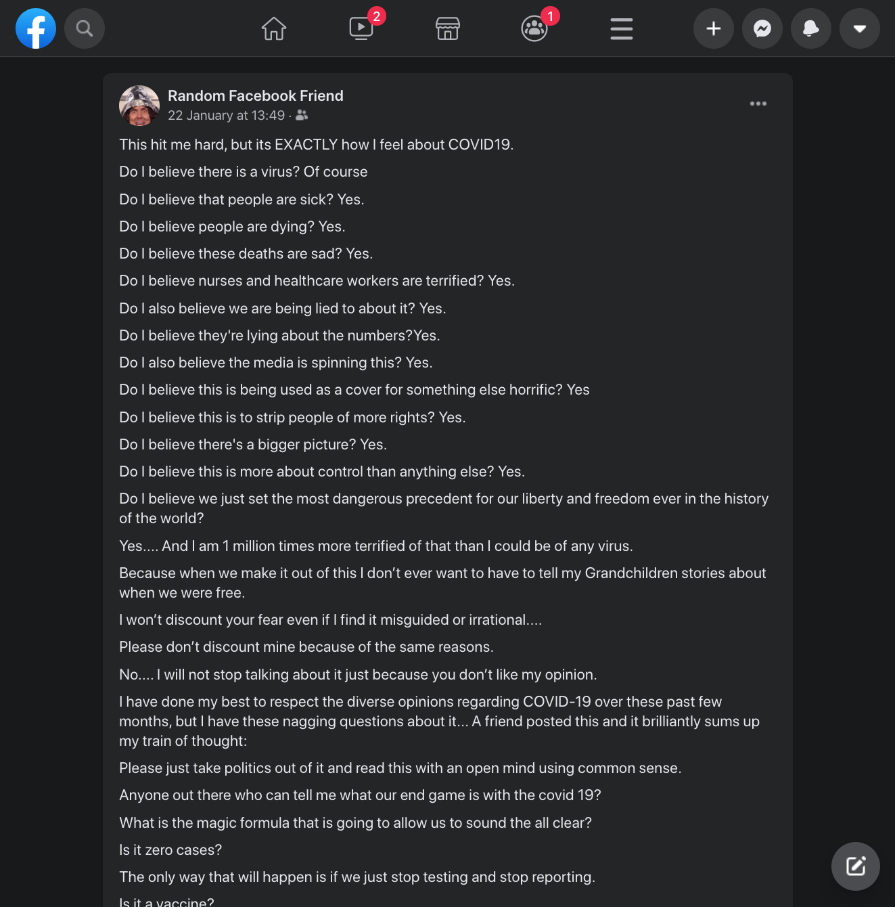

I've been seeing something pop up on Facebook again that I hoped we were collectively beyond. When COVID-19 first started making the news in a big way, back when the 19 was in sync with the current year, [conspiracy theories started popping up online](https://www.scientificamerican.com/article/eight-persistent-covid-19-myths-and-why-people-believe-them/). This isn't surprising. And while conspiracy theories aren't unique to the modern world, they certainly are rampant in this era.

When it comes to the pandemic - I get it. We're all exhausted, depleted, burned-out, suffering, and barely holding on. I'm not blaming anyone who has been pushed far enough by family stress, precarious employment, and global trauma to fall for this type of narrative.

But I do think this could offer a moment to reflect and learn a little bit about the conspiracy theories we subscribe to.

## What makes a theory a conspiracy?

The term "conspiracy theory" gets thrown around and reshaped, especially online. At it's core, a conspiracy theory [involves some degree of secret plot concocted by a small and powerful group](https://www.merriam-webster.com/dictionary/conspiracy%20theory). This essentially boils down to two key factors that are required:

1. Some form of power (or wealth) to be had
2. A group trying to gain or maintain that power

Admittedly, this is a pretty broad framework which can include just about any business deal to have ever occured. For the sake of argument, let's apply it to one of the classics:

### Faked moon landing

[The story goes like this](https://www.theparisreview.org/blog/2019/07/18/how-stanley-kubrick-staged-the-moon-landing-and-other-stories/): Fearing further losses to the USSR in the space race, the US government hired Stanley Kubrick to film Neil Armstrong stepping foot on a Hollywood set done-up to look like the moon.

Do we have some form of power to be had? Sure - the push to be the first side of the cold war to put a person on the moon was massive. The perception of technological and scientific superiority around the globe was on the line.

Do we have a group trying to gain or maintain power? Yup - the US had suffered embarrasment and defeat over [Sputnik reaching orbit in 1957](https://nssdc.gsfc.nasa.gov/nmc/spacecraft/display.action?id=1957-001B) and [Yuri Gagarian following it in 1961](https://www.nasa.gov/mission_pages/shuttle/sts1/gagarin_anniversary.html). Russia was pacing ahead and the US was upset. With [JFK's 1962 declaration of a moon landing "in this decade"](https://airandspace.si.edu/stories/editorial/we-choose-go-moon-and-other-apollo-speeches), the stakes could hardly be higher.

Does this mean the theory is true? No. It just means it is a coherent candidate.

## What makes a conspiracy theory plausible?

This one involves some critical thinking.
